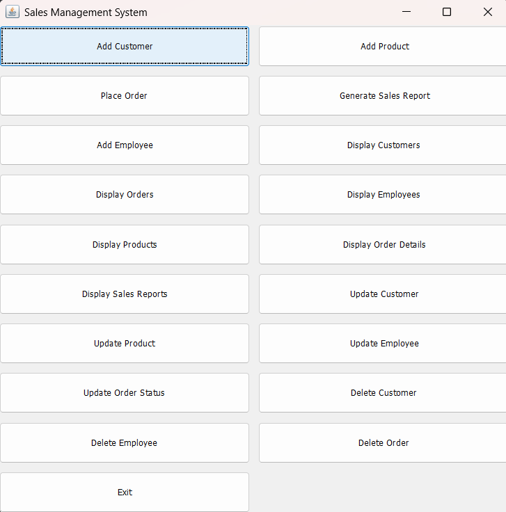
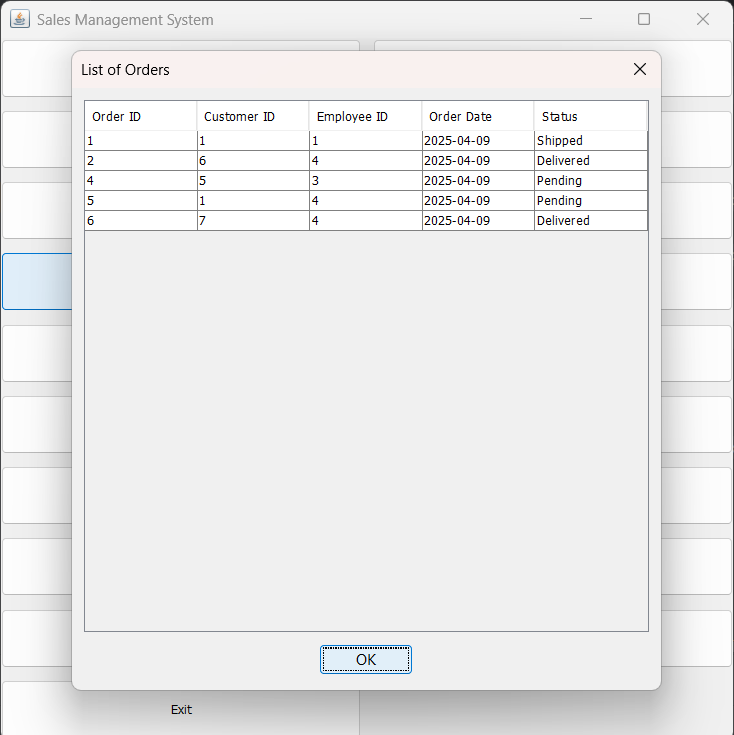
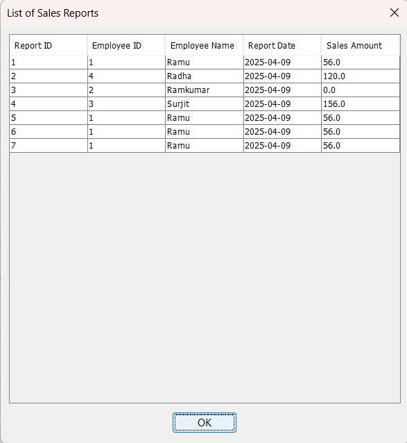
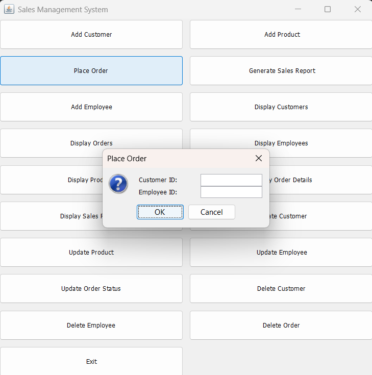

# Sales Management System (Java + MySQL)

A comprehensive **Sales Management System** written in **Java (Swing GUI)** with **MySQL database integration**. It helps businesses manage their core operations including customer info, products, orders, employees, and sales reports—all through a simple desktop interface.

---

## 🧰 Key Features

- ✅ Customer, Product, and Employee management (Add, Update, Delete)
- 📦 Place and manage orders with item-level tracking
- 📊 Generate daily sales reports per employee
- 🔒 Uses MySQL with JDBC for robust data storage
- 🖥️ Built using Java Swing with a clear, grid-based UI
- 🔁 Uses transaction management and foreign key constraints

---

## 📚 Technologies Used

- **Java (Swing GUI)**
- **MySQL** with relational schema design
- **JDBC** (Java Database Connectivity)
- **Maven/IDEA/NetBeans** (Recommended IDEs)

---

## 🔧 Setup Instructions

### 1. Clone the Repository

```bash
git clone https://github.com/your-username/sales-management-system.git
cd sales-management-system
```

### 2. Configure MySQL

- Create a MySQL database named:
  ```sql
  CREATE DATABASE ProjectSMS;
  ```
- Set your MySQL username and password in `sms.java`:
  ```java
  private static final String URL = "jdbc:mysql://localhost:3306/ProjectSMS";
  private static final String USER = "root";
  private static final String PASSWORD = "admin";
  ```

### 3. Compile and Run

- Import into IDE like NetBeans or IntelliJ
- Run the `sms.java` file

---

## 🗃️ Database Schema Overview

Tables automatically created:
- `Customer`
- `Product`
- `Employee`
- `Orders`
- `Order_Details`
- `Order_Status` (with default statuses like Pending, Shipped, Delivered)
- `Sales_Report`

---

## 🖼️ GUI Overview

Main Menu Includes:
- Add / Update / Delete Customers, Products, Employees
- Place Orders and Update Order Status
- Display info for all modules
- Generate Sales Reports

---

## ⚠️ Input Validation

- Validates phone numbers (10-digit)
- Validates email format
- Rejects invalid stock or quantity

## Screenshots

<p float="left">
  
  
  
  
</p>

## License

This project is open-source and free to use for learning or extension purposes.

## 🙋 Author

**Shivam Panwar**  
📧 shivam.panwar23b@iiitg.ac.in 
🔗 https://www.linkedin.com/in/shivam-panwar-b6b98b22b/ 
🌐 skullcruiser
